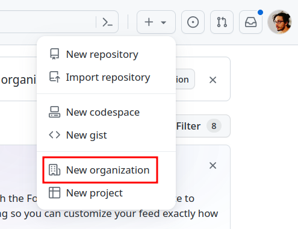

# Project work final report template

[This repository][template-repo] contains a template Software Engineering (SE) reports.

It has been conceived to be used by students of the [Software Engineering course][course-site] 
for their project work.

By adopting this template, students can _automatically_ generate a _static_ Web-site,
which will present their report in fancy way.
Consider, for example, the [site generated from this template][template-site].

To fill the template, students have to put their contents, [in Markdown format][markdown-cheatsheet], 
into the `sections` directory.

The generation of the Web-site is _automatically_ performed by means of GitHub Actions.

Locally, students may visualise a preview of the Web-site by means of [Jekyll][jeckyll-home].

In the following, we provide a number of instruction for using the template,
and for producing the final report.

Please read them carefully, and post any question or clarification request on the 
course's [General forum][general-forum].

## Recommended workflow for the project work

1. Find colleagues to work with (1-4 people, exceptions should be negotiatied with the teacher)

2. Choose a project idea and post a project proposal on the course's [Project forum][project-forum]
    * please provide a __catchy__ and __concise name__ for the project
    * please provide a _brief abstract_ of the project
    * please include the _names_, and __email addresses__ of the team members

3. Wait for the teacher's approval

4. Create a GitHub organization for the project:

    

    1. you should name the organization as follows: `unibo-dtm-se-ACADEMIC_YEAR-PROJECT_NAME`, where
        * `ACADEMIC_YEAR` is the academic year in which the project is carried out (e.g. `2324`, `2425`)
        * `PROJECT_NAME` is the aforementioned catchy name of the project

    2. add all the team members to the organization, with the role of _owner_

    3. add the teacher as well with the role of _owner_ (username: [`gciatto`](https://github.com/gciatto))

5. By means of [this repository template][template-repo], create a new repository in your organization, named `report`
    * use the ad-hoc button to instantiate the template:

        

    * follow the instruction below on how to customise your report

6. Create a new repository in your organization, named `artifact`
    * this repository will contain the _code_ of your project work, if any
    * you may use our [Python project template](https://github.com/unibo-dtm-se/template-python-project) if you want
    * in case your software consists of multiple components, you may consider having multiple repositories, one for each component

7. Post the link to your GitHub organization in the course's [Project forum][project-forum],
in correspondence of your project proposal

8. Work on your project, and on your report

9. When you are done with your project, and with your report, create one more post on the [Project forum][project-forum],
to notify the teacher, and ask for an appointment for the final presentation

## How to customise your report

1. In the `_config.yml` file, you may customise the _title_, the _description_, and, above all, the __URL__ of your report
    + the URL shall be the one of your GitHub Pages site, which will be automatically generated by GitHub Actions
    + most commonly, the generated URL will be of the form `https://ORGANIZATION_NAME.github.io/REPOSITORY_NAME`
        + which, if you followed our instructions, should be: `https://unibo-dtm-se-ACADEMIC_YEAR-PROJECT_NAME.github.io/report`

2. In the `sections/` directory, you may customise the contents of your report
    + files are already there, you just need to write your contents [in Markdown format][markdown-cheatsheet]
    + the template files are already filled with suggestions on what to write

## How to make the report available on the Web

1. The report is automatically generated by GitHub Actions
    + you don't need to do anything, just __commit & push__ your changes to the repository

2. Of course, you may experience some delay before the site is updated
    + you may check the status of the generation by looking at the _Actions_ tab of your repository

3. Of course, the process may fail if the syntax of your Markdown files is incorrect
    + or if you are not compliant to the directory structure or the file naming conventions

## How to visualise a preview of the report, locally

You need to install __Ruby__ on your machine (instructions below).

1. Assuming that Ruby is correctly installed, you need to clone your report repository on your machine:
    
    ```bash
    git clone https://github.com/ORGANIZATION_NAME/REPOSITORY_NAME
    ```

2. Then, you need to restore Jeckyll's dependencies.
From within the root of your repository, run the following command:

    ```bash
    bundle install
    ```


3. Finally, you may run the following command from the root of your repository:

    ```bash
    jekyll serve
    ```

    The output of that command should tell you the local URL where the preview of your site is available.
    Most commonly, it will be <http://127.0.0.1:4000>.

4. Open your browser, and navigate to the URL provided by the previous command
    + from now on, until you stop the `jekyll serve` command, any change you make to the `.md` files will be automatically reflected in the preview
    + you may stop the preview by pressing `Ctrl+C` in the terminal

## How to install Ruby and Jekyll

Follow instructions from here: <https://jekyllrb.com/docs/installation/>

<!-- References -->

[template-repo]: https://github.com/unibo-dtm-se/template-project-work
[template-site]: https://unibo-dtm-se.github.io/template-project-work
[course-site]: https://www.unibo.it/en/study/phd-professional-masters-specialisation-schools-and-other-programmes/course-unit-catalogue/course-unit/2023/466765
[general-forum]: https://virtuale.unibo.it/mod/forum/view.php?id=1512135
[project-forum]: https://virtuale.unibo.it/mod/forum/view.php?id=1544423
[markdown-cheatsheet]: https://www.markdownguide.org/cheat-sheet
[jeckyll-home]: https://jekyllrb.com/
