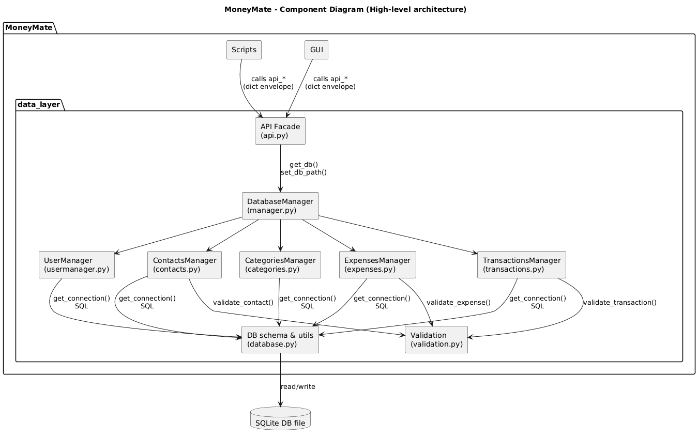
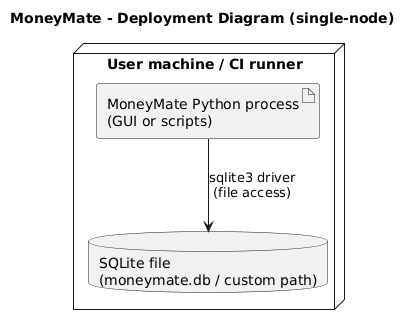
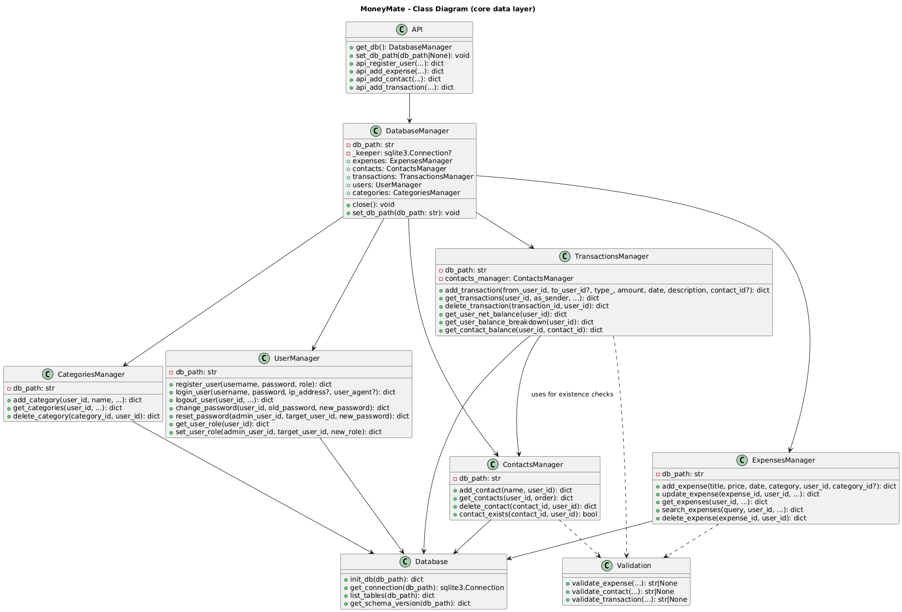
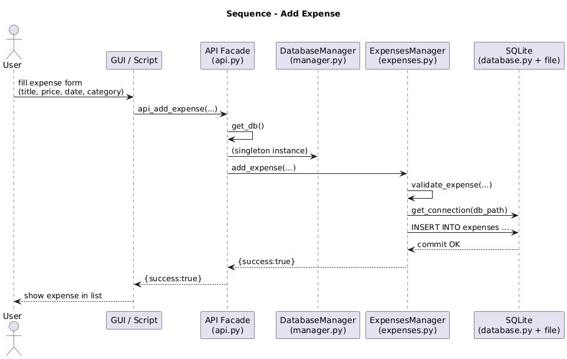
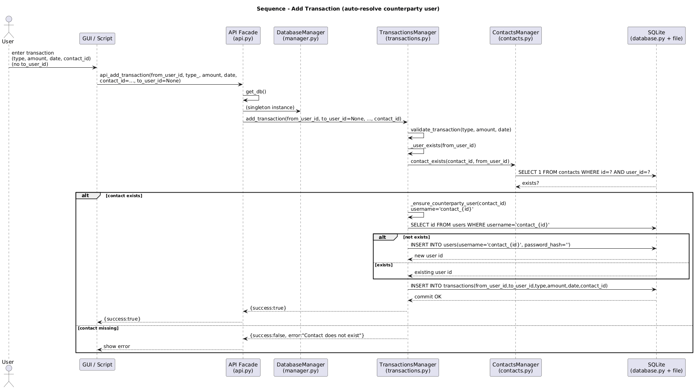
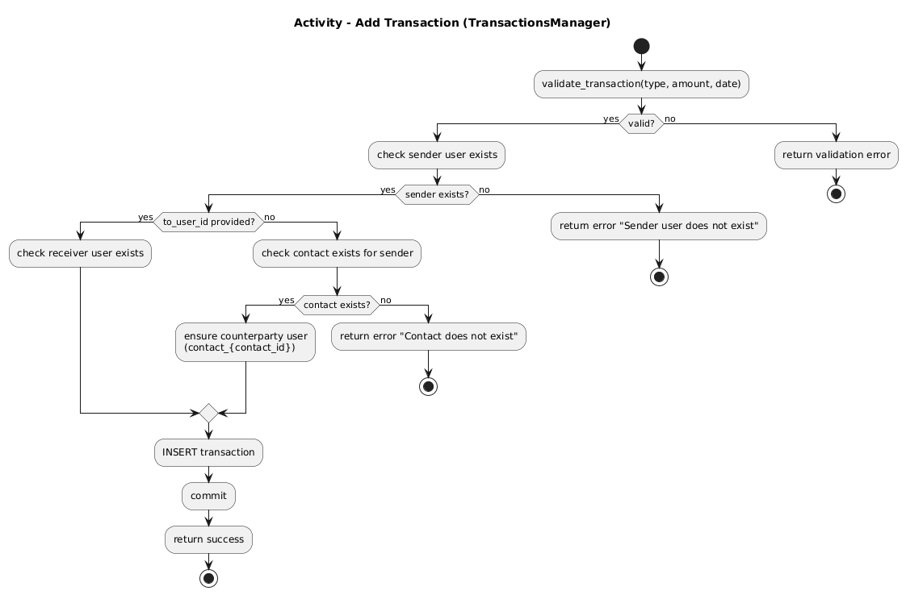

# Design
This chapter explains the strategies used to meet the requirements identified in the analysis. The overall design is intentionally technology-agnostic at the architectural level (separation of concerns, stable interfaces), while the implementation uses Python and SQLite.

## Architecture 
MoneyMate adopts a layered, object-based architecture centered on a data-layer API façade. The main goal is to keep the UI and scripts independent from persistence details and from low-level SQL.

Why layered/object-based?
- The domain is CRUD-heavy (users, contacts, categories, expenses, transactions) and benefits from a clear separation of responsibilities.
- It enables testability and maintainability: the UI can call stable API functions without embedding SQL or DB-specific logic.
- It keeps the persistence technology (SQLite) behind a stable boundary (database utilities + managers).

Why not event-based / microservices?
+ The system is fundamentally a single-user / single-process application with a local database.
+ Introducing brokers, queues, or multiple services would add complexity without a clear benefit for the target scope.

Adopted structure (N-tier / façade-based)
From the code, the architecture can be described as a 3/4-layer system:

1. Presentation / Entrypoint layer
- GUI entrypoint: python -m MoneyMate (via MoneyMate/__main__.py), which delegates to MoneyMate.gui.app.run_gui.
- Scripts entrypoints: e.g., populate_db.py and scripts/init_db.py.

2. Application layer (API Façade)
- MoneyMate.data_layer.api exposes dict-based functions (api_*) that return a standard envelope: {"success": bool, "error": str|None, "data": any}.
- It maintains a singleton DatabaseManager and provides set_db_path() for switching database paths (useful for GUI/test environments).

3. Domain/Application services (Managers / Orchestrator)
- MoneyMate.data_layer.manager.DatabaseManager coordinates sub-managers: UserManager, ContactsManager, CategoriesManager, ExpensesManager, TransactionsManager.
- It also provides backward-compatible “legacy-style” methods (e.g., add_expense, add_transaction) with validation and response normalization.

4. Infrastructure / Persistence layer
- MoneyMate.data_layer.database is the central module for:
    + SQLite connection configuration (foreign keys ON, Row factory),
    + schema initialization (tables + indexes + constraints),
    + schema versioning and non-destructive migration scaffolding,
    + utility functions such as list_tables() and get_schema_version().

## Infrastructure (mostly applies to distributed systems)
MoneyMate is not a distributed system: it is designed to run as a single process on a user machine (or in CI).

Infrastructural components
- Client process: Python application (GUI or scripts).
- Database: SQLite file (local, on disk). The DB path can be configured (via API set_db_path and/or environment variables used in scripts).
- No external components (message brokers, caches, load balancers, separate servers) are required by design.

istribution / location
+ All components run on the same host.
+ In CI, they run on GitHub-hosted runners across OS/Python matrices (from your workflows).

Discovery / naming
+ No service discovery is needed (in-process calls).
+ Components are discovered through Python imports; the database is “discovered” through its configured path.

## Modelling

### Domain driven design (DDD) modelling
A reasonable conceptual decomposition into bounded contexts is:
1) Identity & Access
    - Concepts: User, Role, Authentication, AccessLog.
    - Persistence: users, access_logs tables.
    - Key invariants:
        + unique username,
        + role is constrained (user/admin),
        + access logs are best-effort and should not break auth flows.

2) Personal Finance Tracking
    - Concepts: Contact, Category, Expense, Transaction, Balance.
    - Persistence: contacts, categories, expenses, transactions tables.
    - Key invariants:
        + contacts/categories are scoped by owner user (user_id),
        + expenses belong to a user,
        + transactions have from_user_id != to_user_id, type ∈ {credit,debit}, amount > 0.

Repositories / services
- Managers behave as repositories/application services for each entity, encapsulating persistence and rules.
- The api.py module works as an application façade.

Domain events
- Auth-related events are persisted via access_logs (login, logout, failed_login, password_change, password_reset).

### Object-oriented modelling
Main classes (implementation-level):
- DatabaseManager
- UserManager
- ContactsManager
- CategoriesManager
- ExpensesManager
- TransactionsManager

All of them implement operations returning a shared envelope: {success, error, data}.
Main persisted “entities” (DB tables):
+ users, contacts, categories, expenses, transactions,
+ plus cross-cutting notes, attachments, access_logs, schema_version.

## Interaction
How components communicate
Communication is synchronous in-process function calls:
- GUI/scripts call MoneyMate.data_layer.api functions.
- The API façade calls managers through a shared DatabaseManager.
- Managers communicate with SQLite through database.get_connection().

## Behaviour

- How does **each** component *behave* individually (e.g., in *response* to *events* or messages)?
    + Some components may be *stateful*, others *stateless*

Interaction patterns
+ Facade pattern: api.py provides simple, stable entrypoints.
+ Repository/Manager pattern: each manager encapsulates SQL and domain validation.
+ Singleton: the façade keeps one DatabaseManager instance, protected by a lock.

Typical interaction: “Add Transaction”
1. UI calls api_add_transaction(...).
2. api.py calls get_db().transactions.add_transaction(...).
3. TransactionsManager validates and persists the transaction into SQLite.
4. UI receives the envelope {success, error, data}.

Behaviour
Component behaviour (stateful vs stateless)
+ API façade is stateful only in terms of holding the singleton DatabaseManager.
+ Managers are mostly stateless business components that open connections on demand (DB path stored in the instance).
+ SQLite database is the persistent state of the system.

State updates
- All persistent state updates occur via manager methods that execute SQL statements on SQLite.
- The schema is created/updated by database.init_db().

## Data-related aspects
What data is stored, where, and why
MoneyMate stores all application data in a local SQLite database to ensure:
+ persistence across runs,
+ ACID transactions for basic consistency,
+ portable and simple deployment (single file).

Stored data includes:
- authentication and roles (users, access_logs),
- user-scoped entities (contacts, categories, expenses),
- peer-to-peer tracking (transactions),
- optional metadata (notes, attachments),
- schema versioning (schema_version).

Storage model
The persistence model is relational (SQLite). It is appropriate because:
+ relationships (user → contacts/categories/expenses) are naturally relational,
+ constraints and indexes can enforce integrity and performance.

Who queries the DB and when
All DB queries are performed by the entity managers.
Common query patterns:
- listing with deterministic ordering,
- filtering by date range,
- pagination with limit/offset,
- per-user scoping through user_id,
- balance aggregations via SQL SUM/CASE in TransactionsManager.

Concurrency considerations
+ The design assumes a single application process; SQLite is suitable for this scenario.
+ Foreign keys are enabled (PRAGMA foreign_keys = ON).
+ The façade uses a lock only for singleton initialization and DB switching (_db_lock).
